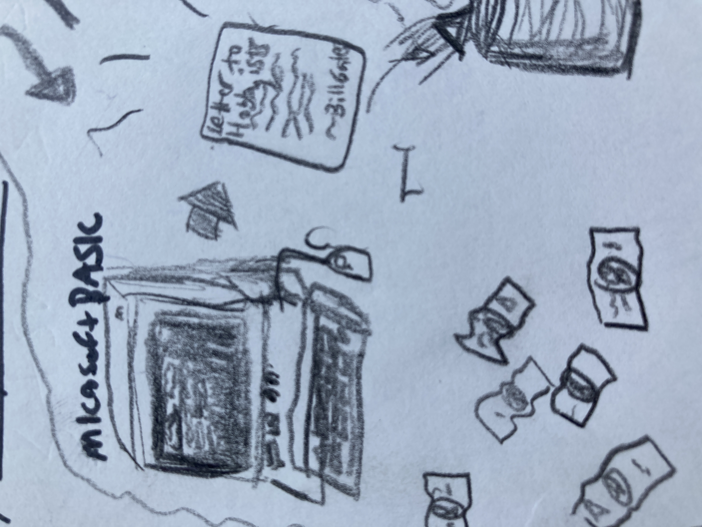
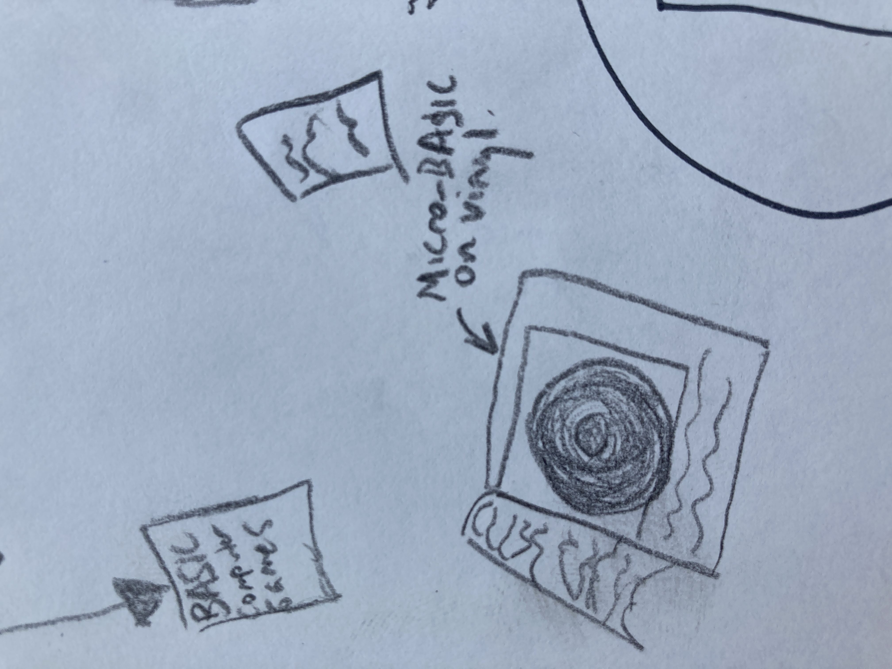
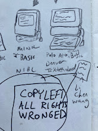
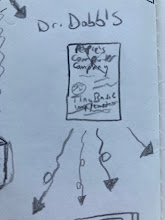
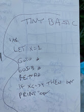

```
       /^\
      |   |
/\     |_|     /\
| \___/' `\___/ |
 \_/  \___/  \_/
  |\__/   \__/|
  |/  \___/  \|
 ./\__/   \__/\,
 | /  \___/  \ |
 \/     V     \/
```


Explorations in Tiny BASIC
--------------------------



Lately I\'ve been getting into BASIC. I was a kid in the 80s and 90s and
I remember those computers that would boot into a BASIC interpreter. I
didn\'t have one of those but came in contact with one every year or two
and played a handful of text games on them. I was aware of some of the
commands and syntax, GOTO and the like, and I have looked through the
classic BASIC Video Games book a number of times. The ecosystem of BASIC
interested me but I hadn\'t delved too deeply. Recently I read about
Tiny BASIC:

> Tiny BASIC is a family of dialects of the BASIC programming language
> that can fit into 4 or fewer KBs of memory. Tiny BASIC was designed in
> response to the open letter published by Bill Gates complaining about
> users pirating Altair BASIC, which sold for \$150. Tiny BASIC was
> intended to be a completely free version of BASIC that would run on
> the same early microcomputers. \--Wikipedia \[1\]




Originally, Tiny BASIC was a specification, not an implementation.
The People\'s Computer Company published a newsletter, almost like a
photocopied zine to my eyes, with articles, tutorials, comix, all aimed
at the nascent hobbyist computer community. They invited Dennis Allison
from Stanford University\'s Computer Science faculty to write the spec.

> The magic of a good language is the ease with which a particular idea
> may be expressed. The assembly language of most microcomputers is very
> complex, very powerful, and very hard to learn. The Tiny BASIC project
> at PCC represents our attempt to give the hobbyist a more
> human-oriented language or notation with which to encode his programs.
> \[2\]

The newsletter goes on to describe the motivation for the project, a
free implementation of the BASIC language, and the community working on
it currently. It specifies what the language could entail, how to solve
various problems, a discussion on creating a compiler versus an
interpreter, what it will take to build one\'s own Tiny BASIC, and a
request for feedback and ideas. It also contained some simple BASIC
games.



### All Rights Wronged

One of the earlier implementations was Dr. Li-Chen Wang\'s Palo Alto
Tiny BASIC, where he may have devised the term copyleft to describe this
process of source code being openly shared and modified and
re-published. He affixed the notice \"COPYLEFT ALL RIGHTS WRONGED\" when
he published it in 1976.

BASIC flourished as a language throughout the 80s and into the 90s. Many
versions of BASIC proliferated, and many versions of Tiny BASIC as well,
including some that grew into more extended versions, sometimes
including the ability to create graphics or sound, rather than just
ASCII text.

In fact, the inital Tiny BASIC implementations allowed printing text
output but couldn\'t receive text string inputs. These were very simple
implementations of BASIC as it had to work with low memory usage. They
allowed for (integer) variables, subroutines via gosub/return,
if-statements (though not if-then or if-then-else), numerical though not
char/string input, and not much else!




The allowed statements were:

    IF - THEN statement
    GOTO #
    INPUT var 
    LET var=expression
    GOSUB #
    RETURN
    CLEAR
    LIST
    RUN
    END

Strings weren\'t defined in the notes, nor were \"remarks\" aka
comments. Missing also were for-loops, random number generation, arrays,
though some of the Tiny BASIC dialects did add these.

I decided to try my hand at making a simple dice gambling game. Where I
grew up Threelo was a popular dice game, and my friends had our own
house rules. But to warm up, I first implemented Pig, a good first game
to program due to its minimal actions and easiness of programming.
Essentially, each turn you roll a die and add the total to your points.
You can stop at any time and keep that total, or keep rolling. If you
ever roll a 1 you lose all the points you accrued. That\'s it! Pretty
\....(wait for it)\.... basic.

I downloaded Damian Gareth Walker\'s Tiny BASIC Interpreter and Compiler
project written in C. \[3\]

It packages a man page and some example games (Hunt the Wumpus, Tic Tac
Toe, and some others).

Without a built-in random number generator, how was I going to create a
random die roll?

Luckily, Gareth published some instructions to construct a minimal
not-very-sophisticated random number generator. \[4\] We don\'t have the
privilege of referencing the clock of the computer for example, so we
follow early BASIC tradition and ask the user for a seed number, then
perform a simple calculation. Some other implementations of Tiny BASIC
came with a random number generator. Gareth\'s doesn\'t by default but
does add in the ability to use REM (remark) for commenting.


To wrap up, I\'ll leave you with this WANTED ad from Volume 1, Number 1
of Dr. Dobb\'s in the section on My, How Tiny BASIC Growed,

> WANTED: Entirely new, never before seen, Tiny Languages, imported from
> another planet or invented here on Earth. Especially languages for
> kids using home computers that talk to tvs or play music or run model
> trains or\...

Links
-----

[Wikipedia article on
TinyBASIC](https://en.wikipedia.org/wiki/Tiny_BASIC)

[Dr. Dobb\'s Journal of Computer Calisthenics and Orthodontia, January,
1976
(PDF)](http://cini.classiccmp.org/pdf/DrDobbs/DrDobbs-1976-01-v1n1.pdf)

[Tiny BASIC Interpreter and Compiler
Portal](http://tinybasic.cyningstan.org.uk/)

[Minimal random number generator for Tiny
BASIC](http://tinybasic.cyningstan.org.uk/download/10/random-number-generator)

[Kingdom of the Lyre
game](http://tinybasic.cyningstan.org.uk/download/44/kingdom-of-the-lyre)

[Tom Pittman\'s Tiny BASIC User
Manual](http://www.ittybittycomputers.com/IttyBitty/TinyBasic/TBuserMan.htm)

[my Tiny BASIC games repo with a better computer opponent for PIG dice
game](https://tildegit.org/exquisitecorp/tinybasic-programs)

