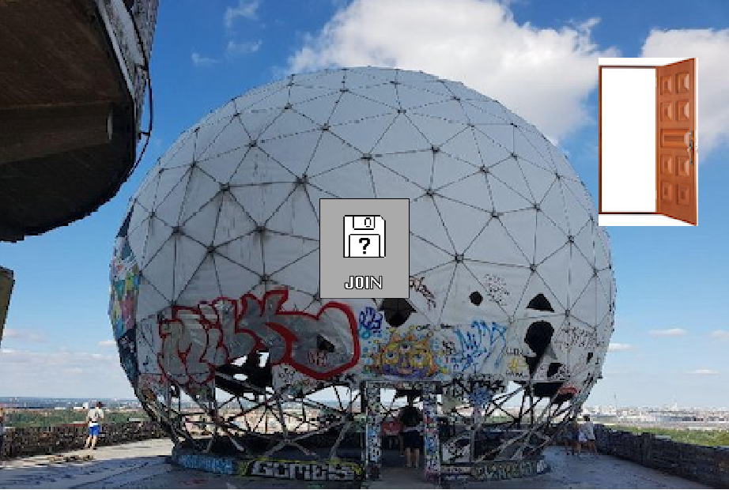

# Xzone

A Do It Together platform for online community-making 

Participants in this workshop will create their own D.I.T. (“Do It Together”) 2D networked online meeting places. We will introduce the idea of virtual temporary autonomous zones based on the concept of temporary autonomous zones, the socio-political tactic of creating temporary spaces to evade formal structures of control. We will teach how to create a simplified networked graphical community meeting space based on this concept, including creating avatars, room interiors and interactive objects, inspired by physical spaces such as the squat, loft, community space, or campsite.

### Slides

[pdf](https://raw.githubusercontent.com/lee2sman/lee2sman.github.io/master/projects/xzone/xzone-slides.pdf)

## Our Plan

- Introduce ourselves
- What's a TAZ?
- What is a virtual TAZ?
- Intro to Likelike
- What can we do here?
- Build out our own zone
  - collect/make images
  - avatars
  - spaces
  - sounds
  - code
- occupy the xzone

### Tools

#### Image
- [100px cam](http://leetusman.com/everyday/145/) - Lee's quick 100pixel camera, exports as png
- [Remove Background](https://www.remove.bg/) - remove backgrounds of images simply
- ezgif [sprite sheet cutter](https://ezgif.com/sprite-cutter)
- [Flickr Creative Commons search](https://www.flickr.com/search/?text=&license=2%2C3%2C4%2C5%2C6%2C9)

#### Audio
- [Freesound](https://freesound.org/) - free / creative commons sound effects and samples
- [Free Music Archive](https://www.freemusicarchive.org/search) - free / creative commons music
- [jsfxr](https://sfxr.me/) - make 8bit sound effects

### Web platform

- [Anticapitalist Software License](https://anticapitalist.software/)
- [Neocities](https://neocities.org/browse) - inspiration?
- [Likelike](https://glitch.com/~likelike) on Glitch
