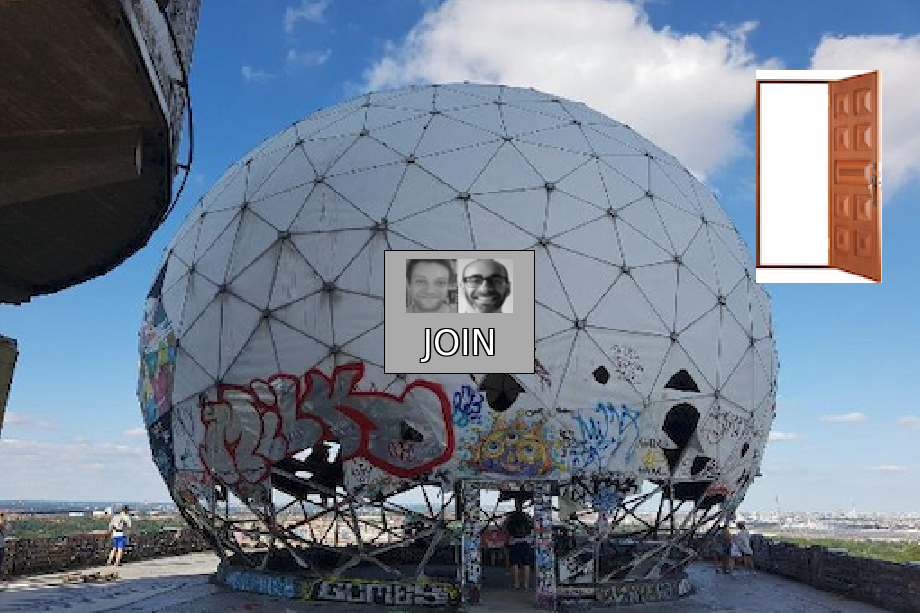

# Xzone

A Do It Together platform for online community-making 

Presented in collaboration with [Daniel Lichtman](http://daniellichtman.com).

*Presented as part of [Our Networks, 2020](https://ournetworks.ca): Growing Our Networks in Uncertain Times and Places. Toronto, CA. Online/distributed.*

Participants in this workshop will create their own D.I.T. (“Do It Together”) 2D networked online meeting places. We will introduce the idea of virtual temporary autonomous zones based on the concept of temporary autonomous zones, the socio-political tactic of creating temporary spaces to evade formal structures of control. We will teach how to create a simplified networked graphical community meeting space based on this concept, including creating avatars, room interiors and interactive objects, inspired by physical spaces such as the squat, loft, community space, or campsite.



## Link

- [Xzone](http://xzone.glitch.me/) on Glitch - choose an avatar and name and join in
- [its code on Glitch.com's server](https://glitch.com/edit/#!/xzone) - *sign into Glitch.com and then click Remix in the top right to make your own*

### Infrastructure

##### Code

This is a fork of Likelike, a DIY space in Pittsburgh, PA, USA as well as a virtual space! It also borrows organizational ideas and some code from Everest Pipkin's [Steam Tunnels](http://steam-tunnels.glitch.me/) fork of Likelike which simplifies some of the code.

#### Make it your own

*See tools section for ways to make this easier.*

##### Change Avatars

1. Remove backgrounds. 
2. Create a spritesheet. (100pixels by 100pixels for each avator , multiplied by however many avatars you have. e.g. 5 avatars is 500 pixels wide by 100 pixels high spritesheet)
3. We used Lee's 100pixel camera, the background remover and the spritesheet maker (*see tools!*).
4. Inside the file ```public > client.js``` we changed the number of avatars to match the participants in our workshop. It's currently line 50, but in case that changes, look for the line ```var AVATARS = 10;``` and change the number to match how many avatars you have on your spritesheet! Or just leave this alone. If you know how to work with this, you can change the default size of your sprites here as well.

##### Change the entry and chat sounds section

1. Record your own audio
2. Or download free sounds
3. Or use an 8bit sound maker (see *tools* section)
4. Previous code experience? Change the audio file names in client.js. No code experience? Change your own sound file names to match the previous soundfile names!

##### Change rooms

1. Rooms are 512pixels x 343 pixels hardcoded. We used the free open-source software [Krita](https://krita.org/en/) to modify some images we had taken or found.
2. You can change the name of the room image files inside data.js OR if you aren't a programmer you can simply replace our room names with your own image files.

##### Where image and sound files are located

We are using Everest Pipkin's idea to store image and sound files on GitHub. Not only is this free, but it allows us to host all files in a single directory, and reduces storage needs on Glitch.com.

The path of our files are located at 

```
https://danielp7.github.io/like-style-assets
```

This process is admittedly not the most beginner-friendly since it requires some ability to use GitHub. Our recommendations for beginners is to just sign in and use the Github.com interface to do everything.

If you want to use a similar infrastructure, you can:

1. Fork our [repo](https://github.com/danielp73/like-style-assets) by clicking on fork in the top right. (Must be logged in).
2. Change the images and/or sound files here. You will have to click *commit* to save.
3. When done with all this, make it live on the internet as its own page. Click on Settings. Scroll down to GitHub Pages. Click Source button and choose *master* (or other branch name you've specified) and click save. If you scroll down again it will give you the URL where your site is live.
4. Back on glitch.com you can open ```public > client.js``` and on (currently) line 72 you can change the URL: ```var ASSETS_FOLDER = "https://danielp73.github.io/like-style-assets/github_assets/";``` to match your own.
5. Phew!

Have suggestions for how we can explain this better? Or other suggestions? Please get in touch via Lee's [email](https://leetusman.com/#info) or [twitter](https://twitter.com/2sman2sman).

### Slides

[pdf](https://raw.githubusercontent.com/lee2sman/lee2sman.github.io/master/projects/xzone/xzone-slides.pdf)

## Our Plan

- Introduce ourselves
- What's a TAZ?
- What is a virtual TAZ?
- Intro to Likelike
- What can we do here?
- Build out our own zone
  - collect/make images
  - avatars
  - spaces
  - sounds
  - code
- occupy the xzone

### Tools

#### Image
- [100px cam](https://leetusman.com/everyday/145/) - Lee's quick 100pixel camera, exports as png
- [Remove Background](https://www.remove.bg/) - remove backgrounds of images simply
- [sprite sheet maker](https://spritesheet.org/)  
- [Flickr Creative Commons search](https://www.flickr.com/search/?text=&license=2%2C3%2C4%2C5%2C6%2C9)

#### Audio
- [Freesound](https://freesound.org/) - free / creative commons sound effects and samples
- [Free Music Archive](https://www.freemusicarchive.org/search) - free / creative commons music
- [jsfxr](https://sfxr.me/) - make 8bit sound effects


#### Web platform

- [Anticapitalist Software License](https://anticapitalist.software/)
- [Neocities](https://neocities.org/browse) - inspiration?
- [Likelike](https://glitch.com/~likelike) on Glitch

### Asset Dimensions

*at this time, these are hardcoded numbers*

#### avatars

- 100pixels x 100pixels

#### rooms

- 512pixels x 343 pixels

## Notes from our workshop 

**This is a free-associative list of references from participants in the Xzone workshop during Our Networks conference 2020. Thank you to everyone who joined us!**

### References 

*collected from workshop participants (thank you!)*

#### IRL references:

- [CHAZ/CHOP info](https://en.wikipedia.org/wiki/Capitol_Hill_Autonomous_Zone)
- Experimental universities like [Rochdale College](https://en.wikipedia.org/wiki/Rochdale_College), [Copenhagen Free University](https://en.wikipedia.org/wiki/Copenhagen_Free_University) 
  - The ABZ of the Copenhagen Free University - [pdf](https://monoskop.org/images/7/75/The_ABZ_of_the_Copenhagen_Free_University_3rd_ed_2006.pdf)
- The People's Library of Occupy Wallstreet - [on Wikipedia](https://en.wikipedia.org/wiki/The_People%27s_Library) and [Wordpress](https://peopleslibrary.wordpress.com/)
- [institute for x](https://institutforx.dk/)
- Sprout Distro category of [zines](https://www.sproutdistro.com/catalog/zines/organizing/) on organizing

#### virtual references

- [SWGBBO](https://fak.ovh/)  - *notes: a group of Finnish musicians hacked Habbo hotel and made their own version of it. you can make your own rooms and characters and chat etc. They've been throwing great concerts there. You can register with a fake email if you want, there is no verification.*
- [The Palace](https://en.wikipedia.org/wiki/The_Palace_(computer_program))
  - [The Psychology of Avatars and Graphical Space](https://web.archive.org/web/20180314004652/http://truecenterpublishing.com/psycyber/psyav.html) --*on Wayback Machine*
- [Likelike Online](https://github.com/molleindustria/likelike-online) on GitHub
- video [demo](https://vimeo.com/426868920/c2ae1a7293) on Vimeo.
- [Eigengrau](https://glitch.com/edit/#!/eigengrau) - *similar technical infrastructure - Javascript, socket.io, p5js, made by Craig Fahner*

- [BrowserQuest](https://github.com/browserquest/BrowserQuest) - *multiplayer game environment*

- [Doomsday Supper Club](https://doomsdaysupperclub-ournetworks.glitch.me/)
- *"One cool thing the Doomsday Supper Club fork did was add audio commands, some that only worked in certain rooms, it was really cool"*

### Chat Topics

- *"how spaces/architecture affects people and communities. both in local physical spaces, and cyberspaces.. there's a concept/practice called "Psychogeographies" from Guy Debord that mixes the experience of exploration with the conscious understanding of how we meander though cities and spaces and what effect that has on our lives."*

- *"for TAZ: I really like the format of festival/conference style events that still retain a community of communities along with the autonomy. There's some music festivals like Fusion and smaller volunteer festivals. Chaos Communication Congress is centered around the TAZ with a community/educational focus and is in a community of community little diy village format."* note: [CCC is online this year](https://events.ccc.de/)
